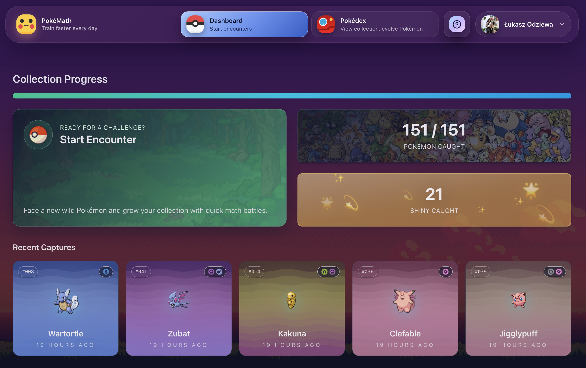
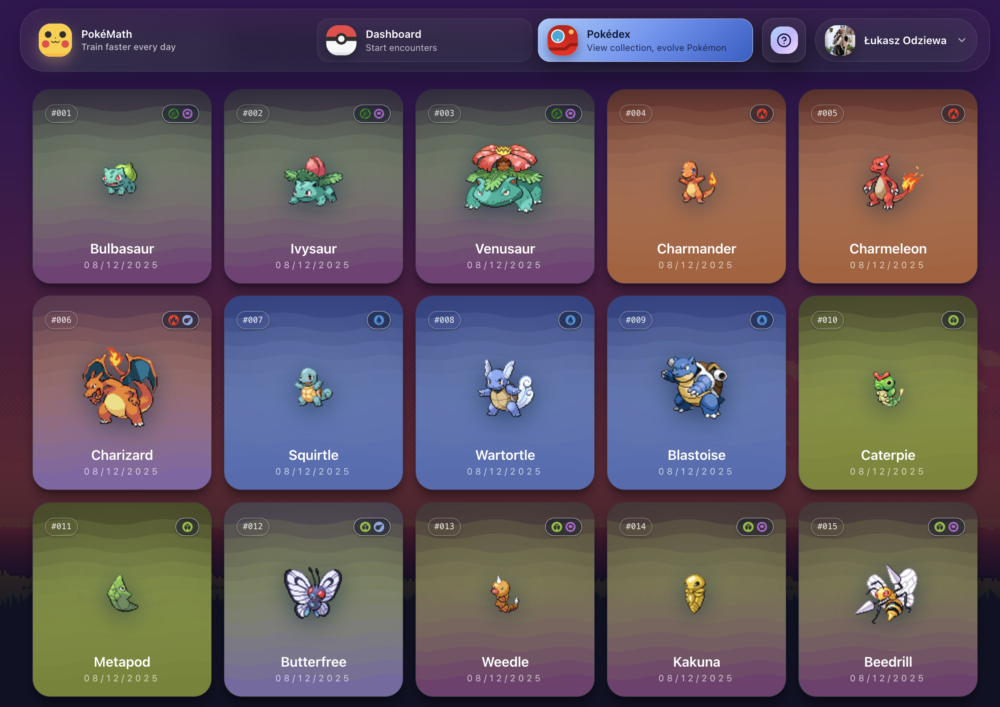
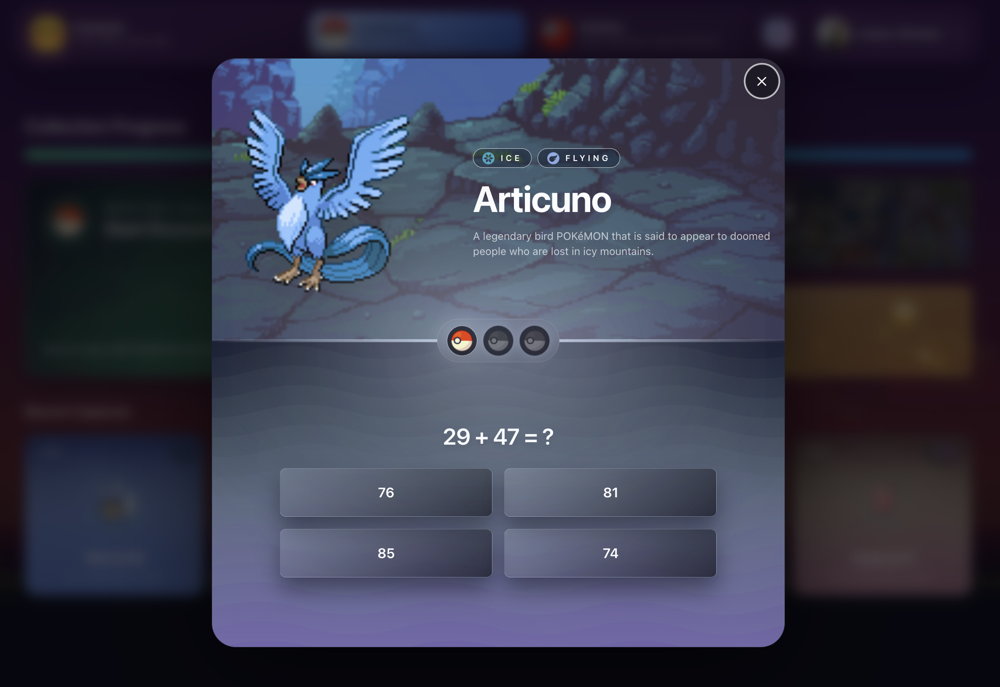
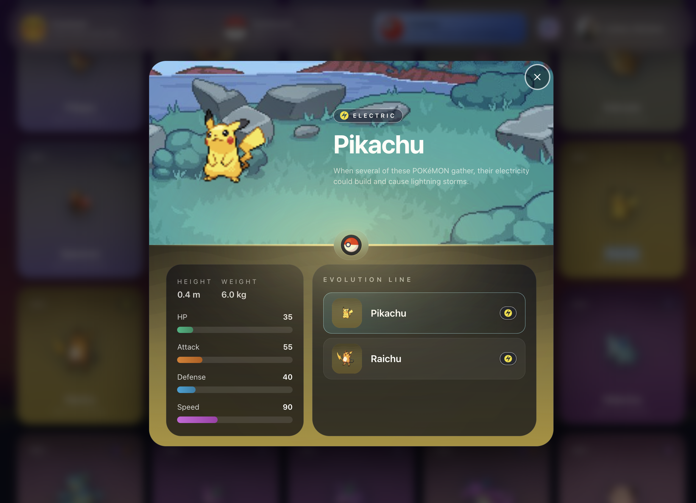
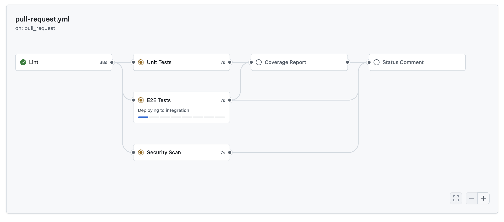
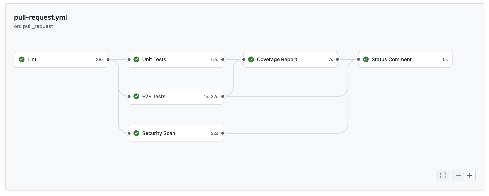

# PokéMath 🎯🧮

🌐 Live: <https://www.pokemath.academy/> 🚀
✅ Actions workflow - <https://github.com/lucek/pokemath-academy/actions/runs/20108585051/>

PokéMath to przeglądarkowa gra edukacyjna łącząca zadania matematyczne z łapaniem Pokémonów. Powstała w trakcie kursu [10xDevs](https://www.10xdevs.pl/) (edycja AI-first), aby ćwiczyć świadome korzystanie z narzędzi AI w produkcyjnym stacku.

## Kryteria zaliczenia 10xDevs ✅

- ✅ **Kontrola dostępu** – użytkownik widzi ekran logowania z Google i nie wejdzie do widoków chronionych bez sesji (głównie `src/layouts/PrivateLayout.astro`).
- ✅ **Zarządzanie danymi** – złapane Pokémony są zapisywane w Supabase z pełnym CRUD-em, RLS i unikalnością wariantu; logika w `src/lib/services/encounter.service.ts`, szczegóły schematu w `.ai/db-plan.md`, a seedy/CLI w `scripts/add-captured-pokemon.mjs` i `scripts/add-all-pokemon.mjs`.
- ✅ **Logika biznesowa gry** – deterministyczny generator zadań (seed per user/pokémon/attempt), szansa na shiny 1/100, limit 3 prób na encounter i wyższe stage dla ewolucji (implementacja w `src/lib/services/encounter.service.ts`, opis w `.ai/prd.md`).
- ✅ **Dokumenty produktowe i kontekst** – komplet materiałów w `.ai/` (`prd.md`, `ui-plan.md`, `api-plan.md`, `db-plan.md`, `tech-stack.md`, `test-plan.md`, `auth-spec.md`) opisuje wymagania, UX, API, bazę i testy.
- ✅ **Testy z perspektywy użytkownika** – Vitest pokrywa logikę/UI, a Playwright E2E przechodzi przez kluczowe ścieżki (logowanie, encounter, kolekcja); konfiguracja w `vitest.config.ts`, `playwright.config.e2e.ts`, scenariusze w `tests/e2e/*`.
- ✅ **Pipeline CI/CD** – workflow GitHub Actions w `pull-request.yml` uruchamia lint, testy jednostkowe, E2E, skan bezpieczeństwa i zbiera raport coverage, dopisując status bezpośrednio do PR.
- ⭐ **Dostępność publiczna** – aplikacja jest dostępna pod adresem <https://www.pokemath.academy/>.

## Jak grać 🕹️

- W każdym wild encounter dostajesz 3 pytania jednokrotnego wyboru.
- Złapiesz Pokémona, jeśli odpowiesz dobrze na co najmniej 2 z 3 pytań; w przeciwnym razie porażka.
- Masz do 3 prób na tego samego Pokémona, potem następuje miękki reroll do innej bazowej formy Gen 1.
- Szansa na shiny: 1/100. Wariant shiny jest liczony osobno w kolekcji.
- Ewolucje odblokujesz po złapaniu formy bazowej; wyzwanie ewolucji podbija poziom trudności.
- Generator zadań jest deterministyczny (seed `user_id|pokemon_id|attempt`) i korzysta z zakresów:
  - Stage 1: dodawanie/odejmowanie 0–20
  - Stage 2: dodawanie/odejmowanie/mnożenie 0–50 (mnożniki 0–10)
  - Stage 3: dodawanie/odejmowanie/mnożenie/dzielenie 0–100 (dzielniki 1–10)

## Zrzuty ekranu 🖼️

### Logowanie — szybkie wejście Google


### Dashboard — Twój progres i ostatnie złapania



### Kolekcja — Twoja siatka Pokédex



### Encounter — 3 pytania, złap albo spróbuj ponownie



### Detal Pokémona — typy, shiny i ewolucje w jednym miejscu



## Architektura w skrócie 🏗️

- Astro 5 (islands, output static) + React 19 + TypeScript 5.
- Tailwind CSS 4 + shadcn/ui + Radix; ikony lucide-react.
- Dane Gen 1 i sprite’y WebP seedowane lokalnie (brak wywołań PokeAPI w runtime).
- Supabase: Auth (Google), Postgres z RLS; tabele `pokemon`, `pokemon_evolutions`, `captured_pokemon` (unikalne `(user_id, pokemon_id, variant)`).
- Deterministyczne zadania matematyczne, cache LRU per user dla redukcji powtórek.
- Zarządzanie danymi klienckimi: React Query + Zustand.

## Artefakty kursowe 📂

- `.ai/prd.md` — wymagania produktowe i pętla gry.
- `.ai/ui-plan.md` — przepływy ekranów i stany UI.
- `.ai/api-plan.md` — plan API/Supabase i kontrakty.
- `.ai/db-plan.md` — schemat bazy, reguły RLS, seedowanie.
- `.ai/tech-stack.md` — decyzje techniczne i narzędzia.
- `.ai/test-plan.md` + `.ai/e2e-test-plan.md` — strategia testów manualnych/E2E.
- `.ai/auth-spec.md` — szczegóły logowania i sesji.
- `.github/workflows/pull-request.yml` — CI dla PR (lint, unit, e2e, security, coverage, komentarz statusu).

## Szybki start lokalnie 🚀

- Wymagania: Node.js 22.14.0 (`.nvmrc`), npm.
- Instalacja: `npm install`
- Konfiguracja środowiska: utwórz `.env.local` z

  ```env
  PUBLIC_SUPABASE_URL=<anon-url>
  PUBLIC_SUPABASE_KEY=<anon-key>
  ```

- Uruchom dev: `npm run dev` (domyślnie <http://localhost:4321>)
- Build / preview: `npm run build` / `npm run preview`

## Supabase 🔐

- Front korzysta wyłącznie z anon/public key (`PUBLIC_SUPABASE_URL`, `PUBLIC_SUPABASE_KEY`).
- Reguły RLS:
  - `pokemon`: publiczny SELECT
  - `captured_pokemon`: CRUD tylko dla właściciela (`user_id = auth.uid()`), unikalność `(user_id, pokemon_id, variant)`
- Skrypty lokalne (wymagają service role tylko na zaufanych maszynach):
  - `node scripts/add-captured-pokemon.mjs --user-id=<uuid> --pokemon=<id|name> [--variant=normal|shiny] [--captured-at=ISO]`
  - `node scripts/add-all-pokemon.mjs --user-id=<uuid> [--variant=normal|shiny|both] [--start=1 --end=151] [--captured-at=ISO] [--dry-run=true]`
  - Wymagane: `SUPABASE_URL` + `SUPABASE_SERVICE_ROLE_KEY` (`VITE_SUPABASE_URL` / `SUPABASE_SECRET_KEY` też obsługiwane).

## Testy ✅

- Jednostkowe (Vitest + RTL, jsdom):
  - `npm run test` lub `npm run test:coverage`
  - Konfiguracja: `vitest.config.ts`, setup w `src/test/setup.ts`.
- E2E (Playwright):
  - Jednorazowo: `npm run playwright:install`
  - Utwórz `.env.e2e` z co najmniej:

    ```env
    ASTRO_SITE=http://localhost:4173
    SUPABASE_URL=<anon-url>
    SUPABASE_KEY=<anon-key>
    E2E_AUTH_MOCK=false # true gdy chcesz stubować auth, jeśli obsługiwane
    ```

  - Uruchom: `npm run test:e2e` (buduje w trybie e2e i startuje dev server na 4173).
  - `playwright.config.e2e.ts` uruchamia testy równolegle, trace `retain-on-failure`.

## CI/CD 🤖

- Workflow `pull-request.yml` (PR na `main`/`master` + ręczny trigger):
  - `lint` (ESLint), `unit-tests` (Vitest coverage), `e2e-tests` (Playwright + Supabase z sekretów `SUPABASE_URL`/`SUPABASE_KEY`/`E2E_AUTH_MOCK`), `security-scan` (`npm audit --audit-level=high`).
  - `coverage-report` pakuje raporty unit + e2e.
  - `status-comment` dodaje komentarz z wynikami do PR.
  - Cache zależności via `actions/setup-node` + `npm ci`.
- Deploy docelowo na Vercel (`@astrojs/vercel`, runtime Node 20); wymagane env: `PUBLIC_SUPABASE_URL`, `PUBLIC_SUPABASE_KEY`. Redirect URL: `/api/auth/callback`.

### Podgląd pipeline

- Widok workflow w GitHub Actions  
  
- Status po przejściu wszystkich jobów (lint/unit/e2e/security/coverage)  
  

## Licencja 📜

- MIT. Pokémon i znaki towarowe należą do The Pokémon Company / Nintendo / Game Freak / Creatures; projekt edukacyjny/fan-made.
